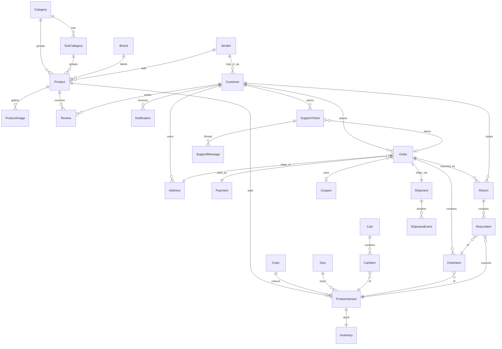

# NK Silk — Entity-Relationship Model

EF Core Code-First. Every entity inherits `BaseEntity` (`Id`, `CreatedAtUtc`, `UpdatedAtUtc`, `IsDeleted`). A global query filter hides `IsDeleted = 1` rows.

## 1. Relationship summary
- **Category** 1—* **SubCategory**, 1—* **Product**
- **Brand** 1—* **Product**
- **Product** 1—* **ProductImage**, 1—* **ProductVariant**, 1—* **Review**
- **ProductVariant** *—1 **Color**, *—1 **Size**, 1—1 **Inventory**
- **Customer** 1—* **Address**, 1—* **Order**, 1—* **Review**, 1—* **WishlistItem**, 1—* **Return**, 1—* **Notification**
- **Cart** 1—* **CartItem**; **CartItem** *—1 **ProductVariant**
- **Order** 1—* **OrderItem**, 1—1 **Payment**, 1—* **Return**, *—1 **ShippingAddress (Address)**, *—1 **Coupon (optional)**
- **OrderItem** *—1 **ProductVariant**
- **Return** 1—* **ReturnItem**, *—1 **Order**, *—1 **Customer**
- **ReturnItem** *—1 **OrderItem**, *—1 **ProductVariant**
- **Notification** *—1 **Customer**
- **Vendor** 1—* **Product**, 1—* **Customer** (seller logins)
- **Order** 1—1 **Shipment**; **Shipment** 1—* **ShipmentEvent**
- **Customer** 1—* **SupportTicket**; **SupportTicket** 1—* **SupportMessage**, *—o| **Order** (optional)
- **Offer** *—o| **Category**, *—o| **Product** (scope targets; null for store-wide)
- **ComboPack** 1—* **ComboPackItem**; **ComboPackItem** *—1 **Product**
- **Customer** *—* **Role** via **CustomerRole**
- **AuditLog** — standalone change-trail (references entity by name + id, actor by customer id)

## 2. Mermaid ER diagram

## 3. Key tables, PKs, FKs, indexes
| Table | PK | Important FKs | Unique / Indexes |
|-------|----|---------------|------------------|
| Categories | Id | — | UX: Slug |
| SubCategories | Id | CategoryId→Categories | UX: Slug |
| Brands | Id | — | UX: Slug |
| Products | Id | CategoryId, SubCategoryId, BrandId | UX: Slug, Sku; IX: (CategoryId, IsActive) |
| ProductImages | Id | ProductId→Products (Cascade) | — |
| ProductVariants | Id | ProductId (Cascade), ColorId (SetNull), SizeId (SetNull) | UX: Sku |
| Colors / Sizes | Id | — | — |
| Inventories | Id | ProductVariantId→ProductVariants (Cascade) | UX: ProductVariantId (1:1) |
| Customers | Id | — | UX: Email |
| Addresses | Id | CustomerId→Customers (Cascade) | — |
| Carts | Id | CustomerId (SetNull) | UX: CartKey |
| CartItems | Id | CartId (Cascade), ProductVariantId (Restrict) | — |
| Orders | Id | CustomerId (Restrict), ShippingAddressId (Restrict), CouponId (SetNull) | UX: OrderNumber |
| OrderItems | Id | OrderId (Cascade), ProductVariantId (Restrict) | — |
| Payments | Id | OrderId→Orders (Cascade, 1:1) | — |
| Coupons | Id | — | UX: Code |
| Reviews | Id | ProductId (Cascade), CustomerId (Restrict) | — |
| WishlistItems | Id | CustomerId (Cascade), ProductId (Cascade) | UX: (CustomerId, ProductId) filtered `IsDeleted=0` |
| Returns | Id | OrderId (Restrict), CustomerId (Restrict) | UX: ReturnNumber |
| ReturnItems | Id | ReturnId (Cascade), OrderItemId (Restrict), ProductVariantId (Restrict) | — |
| Notifications | Id | CustomerId→Customers (Cascade) | IX: (CustomerId, IsRead) |
| Vendors | Id | — | UX: Slug |
| Shipments | Id | OrderId→Orders (Cascade, 1:1) | UX: OrderId; IX: TrackingNumber |
| ShipmentEvents | Id | ShipmentId→Shipments (Cascade) | — |
| SupportTickets | Id | CustomerId (Restrict), OrderId (SetNull, optional) | UX: TicketNumber |
| SupportMessages | Id | SupportTicketId→SupportTickets (Cascade) | — |
| Products (added) | — | VendorId→Vendors (SetNull) | IX: VendorId |
| Customers (added) | — | VendorId→Vendors (SetNull) | IsVendor flag |
| Offers | Id | CategoryId (SetNull), ProductId (SetNull) | UX: Slug; IX: (IsActive, Starts, Ends) |
| ComboPacks | Id | — | UX: Slug |
| ComboPackItems | Id | ComboPackId (Cascade), ProductId (Restrict) | — |
| Roles | Id | — | UX: Name |
| CustomerRoles | Id | CustomerId (Cascade), RoleId (Cascade) | UX: (CustomerId, RoleId) filtered |
| AuditLogs | Id | — | IX: (EntityName, EntityId), CreatedAtUtc |

## 4. Constraints & conventions
- Money columns: `decimal(18,2)`.
- Computed properties (`QuantityAvailable`, `LineTotal`) are `[NotMapped]` (ignored).
- Restrict delete on Order→Customer/Address and OrderItem→Variant preserves historical orders.
- OrderItem stores **snapshots** (ProductName, VariantSku, Color/Size names) so orders remain accurate if the catalogue changes.
